# 轱辘UI — Tabs 组件
## 需求分析

## UI

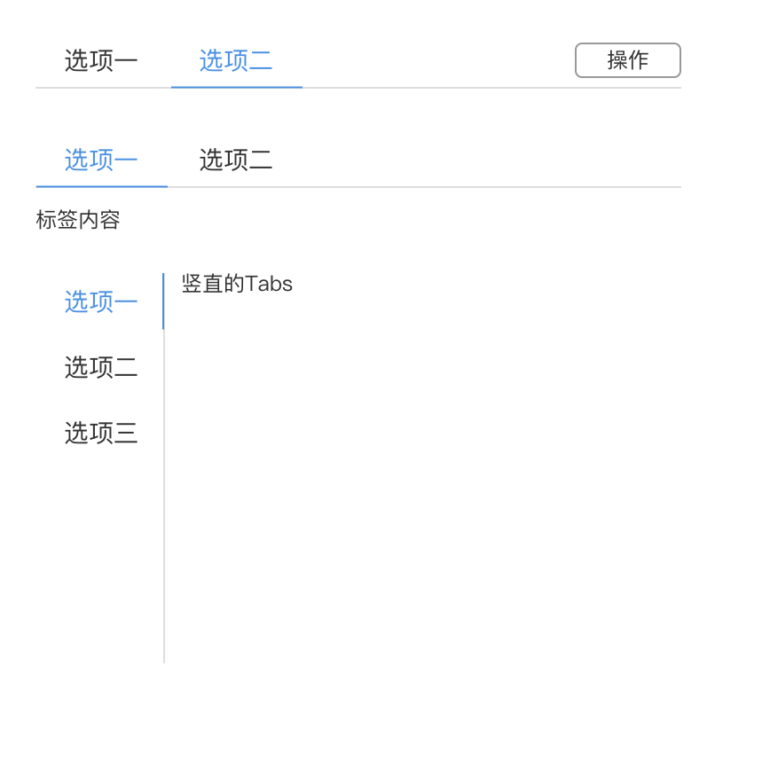

## 设计 API
```html
<g-tabs :selected.sync="selectedTab">
  <g-tabs-head>
    <g-tabs-item name="tabName" disabled>
    </<g-tabs-item>
  </g-tabs-head>
  <g-tabs-body>
    <g-tabs-pane name="tabName">
    </g-tabs-pane>
  <g-tabs-heade>
</g-tabs>
```

* g-tabs | selected = 当前选择 Tab 的 name 的值 | direction = 指定 Tabs 横向或纵向的样式
* g-tabs-head | disabled = 该 Tab 是否被禁用
	* g-tabs-item | name = tab 标题的名称
* g-tabs-body
	* g-tabs-pane | name = tab 内容区的名称和标题名称对应

## 修饰符 `.sync` 的使用
我们在构思 Tabs 组件如何实现时，会想到我们需要把 `selectedTab` 的数据传入到子组件（`g-tabs`）中。在`g-tabs` 组件改变了当前 Tab 时，又会需要修改`selectedTab `的值。
描述的这种场景，Vue 给我们提供了一个方便的修饰符号`.sync`
在不用`.sync` 时，我们会这样子写代码

```html
<g-tabs
  v-bind:selectedTab="selectedTab"
  v-on:update:title="selectedTab = $event"
></g-tabs>
```

使用`.sync` 将会是
```html
<g-tabs v-bind:selected.sync="selectedTab"></g-tabs>
```

* [Vue.js 自定义事件 — .sync 修饰符](https://cn.vuejs.org/v2/guide/components-custom-events.html#sync-%E4%BF%AE%E9%A5%B0%E7%AC%A6)

## 在使用组件的时添加 class 在渲染的 HTML 中会和组件声明时的合并
官方文档描述的。例如，如果你声明了这个组件：
```vue
Vue.component('my-component', {
  template: '<p class="foo bar">Hi</p>'
})
```
然后在使用它的时候添加一些 class：
```vue
<my-component class="baz boo"></my-component>
```
HTML 将被渲染为:
```html
<p class="foo bar baz boo">Hi</p>
```

通过这个特性，「轮子」的使用者可以很方便的修改、添加样式

* [Vue.js Class 与 Style 绑定 — 用在组件上](https://cn.vuejs.org/v2/guide/class-and-style.html#%E7%94%A8%E5%9C%A8%E7%BB%84%E4%BB%B6%E4%B8%8A)
## 「事件中心」
不使用「事件中心」我们的代码逻辑会比较的复杂。大致的情况我们可以从下面这个图来理解它的复杂性。


当我们引入「事件中心」，再来看看`g-tabs-item` 组件被点击时需要做的事情。先通知 EventBus。EventBus 再通知各个相关的组件，逻辑就会更简单、清晰，看起来如下图
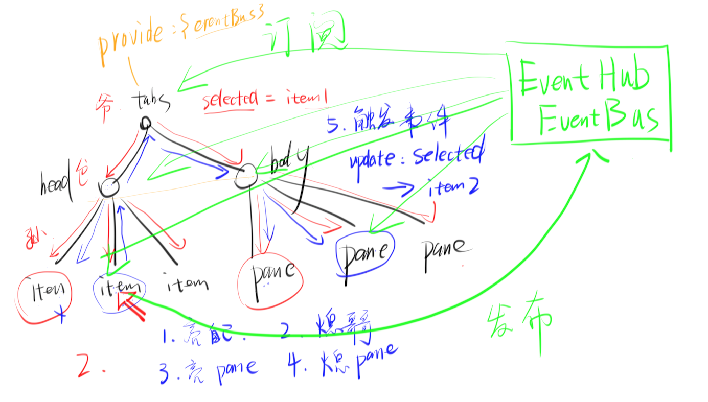

我们先提供事件中心，也就是一个 Vue 的实例。再通过「依赖注入」让相关子组件拿到这个 做为「事件中心」的 Vue 实例，并在子组件内监听事件中心的事件。这样我们在任意一个子组件触发事件，其他的组件就能收监听到了

## 「依赖注入」
* `$` 开头的命名是提供给框架使用者的
* `_` 下划线开头的私有属性，不要滥用

我们在`g-tabs` 中`new Vue()` 来让这个 Vue 实例作为全局的事件中心。为了让`g-tabs`  的所有后代组件都拿到这个事件中心的 Vue 实例的引用，我们可以通过 Vue 给我们提供的 API `provide / inject`，允许一个祖先组件向其所有子孙后代注入一个依赖。看看官方文档中给出的简单示例：
```js
// 父级组件提供 'foo'
var Provider = {
  provide: {
    foo: 'bar'
  },
  // ...
}

// 子组件注入 'foo'
var Child = {
  inject: ['foo'],
  created () {
    console.log(this.foo) // => "bar"
  }
  // ...
}
```

* [Vue.js API — provide-inject](https://cn.vuejs.org/v2/api/#provide-inject)
* [处理边界情况 — Vue.js](https://cn.vuejs.org/v2/guide/components-edge-cases.html#%E4%BE%9D%E8%B5%96%E6%B3%A8%E5%85%A5)

## Tab 切换实现的思路
在 tabs 的 mouted 阶段触发 `update:selected` 事件，把用户传入prop 的 selected 的值发送出去
item 点击时让通知中心触发`update:selected` 事件，并把自己的`name`传出去
每一个 item 和 body 都会在 created 声明周期去监听`update:selected` 事件，在监听的回调函数中可以拿到当前被点击 item 的 name 的值，并且去判断 事件中心发出的 name 是否和自己的 name 相同，如果相同那么该 item 就是 active 状态把自己的 data 中的 active 修改为 true ，不相同就改为 false。 class 动态绑定让 active 为 true 时，HTML 中有 active 的 class 否则没有


## 关于`g-tabs-item` 的是否激活状态`active`的思考
是使用`prop` 还是使用`data` 呢？看看 `prop` 和 `data` 的区别。
`prop` 是需要从外部传入，而 `data` 是组件内部维护。这个好比函数的参数和函数内的声明的变量。
我们在 `g-tabs-item` 在组件内定义一个叫`active`的 data，在`g-tabs`创建时会

## `g-tabs-head` 用具名插槽来添加一个按钮

## Tab 切换时的动画效果
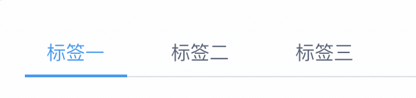
我们想拿到被点击 Vue 实例的 $el 来获取当前点击元素的位置，从而用 JS 来动态的改变 `line` 的位置。就可以用CSS 的 `transition` 来实现切换的动画


## 添加 disabled 功能
在点击的时候加一个判断，如果 `disabled=true` 时直接 return。并增加`disabled` 状态的 class 并增加样式

## 增加子元素的检查
## 增加纵向布局方式
Tabs 组件接收一个`direction` 的参数，可选值为`vertical`和`horizonta`，通过「依赖注入」的方式让 Tabs-item 拿到 `direction ` 参数的值。Tabs-item 拿到值以后做下面两件事
* 动态绑定 class 再给两种布局方式分别写 CSS 样式
* 用户点击 Tab 后，用 JS 修改指示条的位置及宽高时，根据`direction `的值，做判断后再修改

## 解决动画的 BUG
要修正偏移，因为`getBoundingClientRect`方法的`left`、`top` 的值是相对于页面的位置。

## ES6 对象的解构赋值给我们带来便利
现在有两个元素的需要通过 `getBoundingClientRect` 来获取位置
```js
// ES6 对象的解构赋值
let {left}  = xxx.getBoundingClientRect()
// left 变量已经被声明，直接这样会覆盖前面的
let {left} = yyy.getBoundingClientRect()
// 我们这样写就会拿到 yyy 的 left 的值并声明一个变量是 left1
let {left: left1} = yyy.getBoundingClientRect()
```

``` javascript
let obj = { first: 'hello', last: 'world' };
let { first: f, last: l } = obj;
f // 'hello'
l // 'world'
```
这实际上说明，对象的解构赋值是下面形式的简写（参见《对象的扩展》一章）。也就是说，对象的解构赋值的内部机制，是**先找到同名属性**，然后再赋给对应的变量。**真正被赋值的是后者**，而不是前者。

## 写测试用例
## Tabs 组件的子组件只能是 Tabs-head 和 Tabs-body
## 测试代码期待会报错
在 Tabs 组件 `mounted` 阶段检查子组件的合法性。如果不合法会抛出错误。
[Expect / Should - throw - Chai](https://www.chaijs.com/api/bdd/#method_throw)

## Tabs 组件接收`selected` 参数
在测试代码中，我们很难去给组件构造一个子组件。我们可以使用 JS 给一个 div 元素添加 `innerHTML`，添加的字符串是 Vue 的模板。然后让一个 Vue 实例挂载到 div 上。

```js
const div = createElement('div')
document.body.appendChild(div)
div.innerHTML = `
	<g-tabs selected="hi">
    // 直接写子组件
    <g-tabs-head>
      <g-tabs-item name="hi"></g-tabs-item>
    </g-tabs-head>
  </g-tabs>
`
let vm = new Vue({el: div})
// 再写后续断言...
```

在 测试 Tabs 组件中，我们传入`selected` 让 Tabs-item 组件更新 active 状态。但是，Vue 更新 DOM 是异步的，要在`$nextTick` 中才能拿到真实的 DOM 数据。所以测试代码中的断言也需要在 `$nextTick` 的回调中进行

## 让代码变得更加「可测试」
上面测试`selected`代码中，给 Tabs 传入 `selected` 为`hi`。我们期待的是 Tabs-item 组件 name 是 `hi` 的组件将被选中。
但是这个「被选中」的状态是不方便去测试的，我们可以在源代码中增加一个标记，让代码在测试时更加方便。
比如这里，我们在源代码中让 Vue 给 Tasb-item 组件的跟节点增加一个HTML 属性`data-name`，属性的值是该组件的`name`的值。这样我们在测试代码中就很方便找到这个元素了。

另外一个例子，我们在测试 Tabs-item 的 `disabled` 的功能时，是监听该组件的`click`事件。但源代码中并没有直接触发`click`事件，故测试代码中无法监听`click`事件。我们可以通过在源代码中让组件触发该事件，让代码「可测试」

## 测试 Tabs 组件`direction`参数，将改变 Tabs 组件的布局
要通过 `getComputedStyle`测试 CSS 的样式，记得将组件挂载到页面（也就是`document`元素）。否则的话组件实例只是被挂载到内存中，会导致获取不到样式

```js
let div = document.createElement("div");
document.body.appendChild(div);
const Constructor = Vue.extend(Tabs);
const tabs = new Constructor({
  propsData: {
    direction: "vertical"
  }
});
tabs.$mount(div);
```
## 测试 Tabs-item 组件接收`disabled`，将禁用该 tab 的点击
还是利用间谍函数`sinon.fake()`。我们先让组件监听`click`事件，并指定回调函数是我们生产的间谍函数，再用 JS 触发`click`事件后，期待该间谍函数没有被调用。


# 轱辘UI — Button 组件

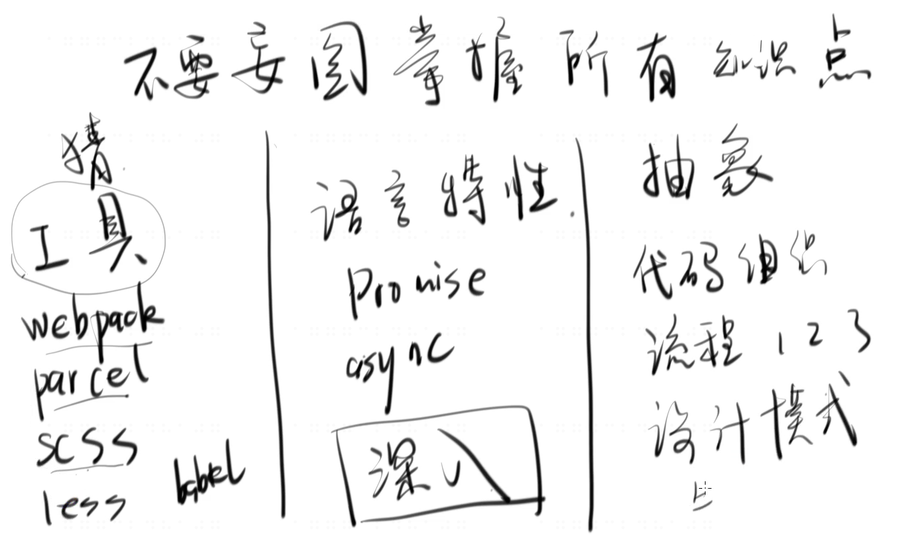

## Button 组件的需求分析
拥有几种状态
* 普通
* hover
* 按下
* loading

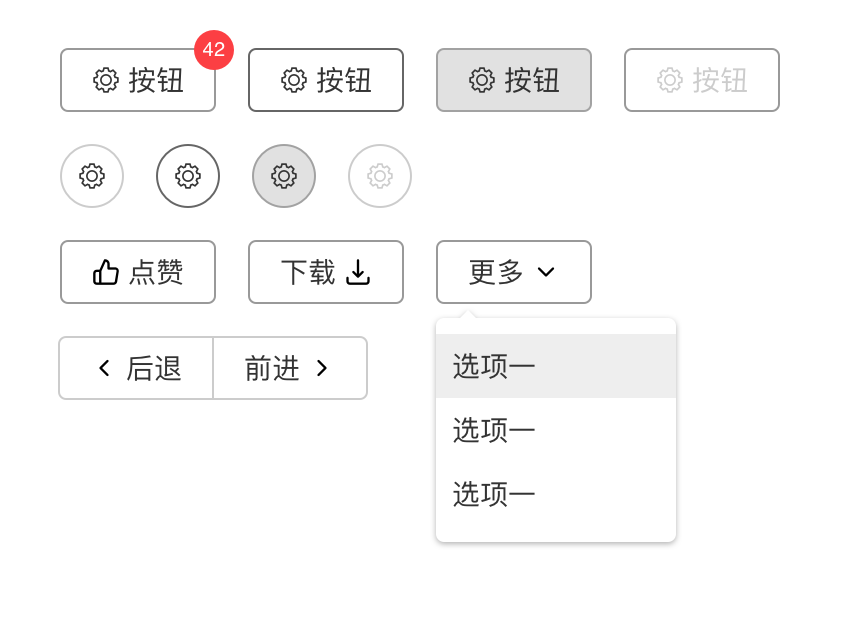


## 使用 CSS 变量
### 声明变量
```css
:root{
  --button-height: 32px;
}
```

### 使用变量
```css
.btn {
  height: var(--button-height)
}
```

### 关于 CSS 变量的作用域

* [使用CSS变量 - CSS：层叠样式表 | MDN](https://developer.mozilla.org/zh-CN/docs/Web/CSS/Using_CSS_variables)
* [CSS 变量教程 - 阮一峰的网络日志](http://www.ruanyifeng.com/blog/2017/05/css-variables.html)
* [关于CSS变量你需要知道的一切 - 众成翻译](https://www.zcfy.cc/article/everything-you-need-to-know-about-css-variables)

## `npx`

该工具致力于提升开发者使用包提供的命令行的体验。npx 允许我们使用本地安装的命令行工具而不需要再定义 npm run-script，并且允许我们仅执行一次脚本而不需要再将其实际安装到本地

```zsh
./node_modules/.bin/parcel index.html --no-cache
```
替换成
```zsh
npx parcel index.html --no-cache
```

## Vue `slot` 的使用
使用插槽将文字插入到 `g-button` 组件中

## 使用 svg 制作 icon 并插入组件中
使用[Iconfont-阿里巴巴矢量图标库](http://iconfont.cn) 中的图标资源，首先在页面引入 iconfont 给我们提供的 js。这个 js 文件会添加一个 svg 标签到页面中。并把让这个标签隐藏起来，我们在页面中就可以使用 svg 里面的 symbol
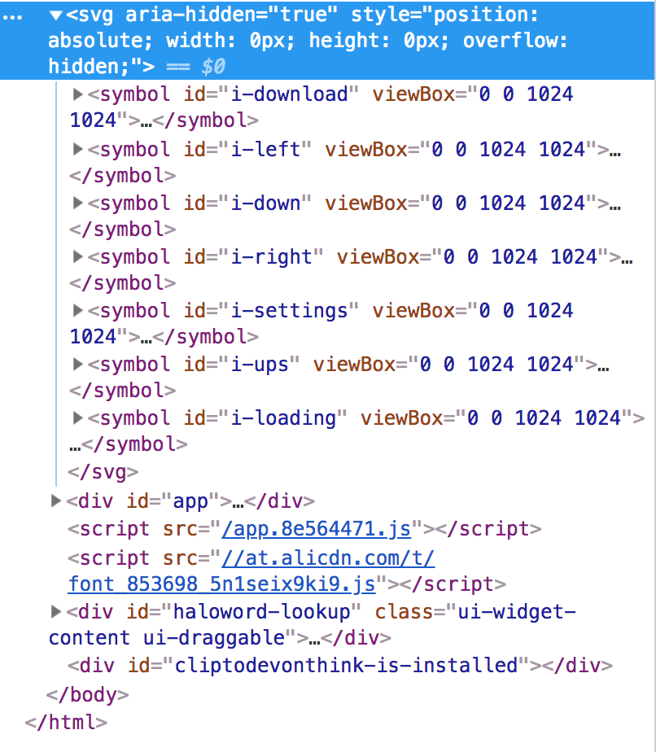
使用方法
```js
<svg class="icon" aria-hidden="true">
    <use xlink:href="#icon-xxx"></use>
</svg>
```

## 使用 props 给组件传参数
由于我们是造轮子，写代码时主要需要考虑到组件的提供给别人使用的便利性。不需要使用者在`g-buttom`组件中插入 icon。他只需要给组件传入一个`icon`的属性，就可以指定在组件中使用哪个 icon 图标。如
```html
<g-button icon="settings"></g-button>
```

## 使用 v-if 在没有传入 icon 的值时不渲染 svg

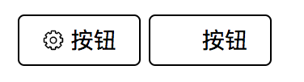

在不给 `g-button` 传入 `props`时，会出现一个空图标在按钮内。我们需要使用 `v-if` 来解决

## 控制 `icon` 在文字的左右位置
给组件传入一个参数`orientation` 可以是 `left` 或 `right`
组件内通过 `props` 拿到传入的值。简单粗暴的办法使用 `v-if`和 `v-else`，在不同情况下渲染两个不同的 Button 按钮。但这样并不算是「好代码」，因为有太多的重复代码，而且原则是样式相关的我们应该交给 CSS 处理。

先看看这个代码
```js
let str = "hello"
let obj = {[str]:"javascript"}
console.log(obj) //{hello: "javascript"}
```
这里`obj` 的键名是一个变量，所以使用中括号来写这个键名。
再引申到 Vue 的动态绑定 Class 对象语法中
```js
<button :class="{[orientation],true}"><button>
```

⭐️ 这样写可以让 button 永远都会有一个 class，这个 class 的是什么。由`orientation ` 这个变量来决定。这样就实现了，在传入`left` 时。元素上就会拥有一个`left`的类。

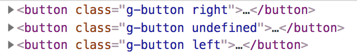

## 再使用 CSS flex 的`order` 属性来控制位置
有了动态的 class，我们就可以在 CSS 中来做文章（控制图标的左右），我们利用 flex 布局的`order` 来实现。
> order 属性定义项目的排列顺序。数值越小，排列越靠前，默认为0

CSS Tip：在遇到两个内联元素之间上下无法对齐的时候，给这两个内联元素加CSS属性`vertical-align: middle;`
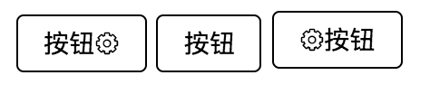

## Vue  `props`验证的检查器 `validator`
在使用者传入不是 `left` 或 `right` 时。抛出错误，并设置默认是`left`（图标在文字的左侧显示）
```js
validator(value){
  return ['left','right'].indexOf(value) !== -1
}
```
## 将 svg symbol 制作的图标封装成 `Icon`的 Vue 单文件组件
## 用 CSS3 动画添加 loading 态的 icon 动画
* 定义一个动画
```css
@keyframes spin {
  0% {
    transform: rotate(0deg);
  }
  100% {
    transform: rotate(360deg);
  }
}
```
* 使用动画
```css
.loading {
  animation: spin 1s linear infinite;
}
```
[使用 CSS 动画 - CSS：层叠样式表 | MDN](https://developer.mozilla.org/zh-CN/docs/Web/CSS/CSS_Animations/Using_CSS_animations)

## 点击按钮切换 loading 状态
组件内使用 `$emit()` 来触发一个自定义事件。在外部监听 click 事件，在事件触发时改变 loading 的值
## `g-button-group` 组件的实现
为了在两个 `g-button` 连在一起时，连接侧的按钮圆角会没有。

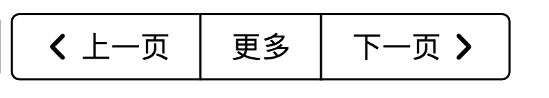

我们在 `.g-button-group`类下的直接子元素，所有的`g-button` 类的 `border-radius` 属性设置为 0，
使用 CSS 选择器`:last-child`和`:first-child` 对两头的元素进行单独设置，还原所需圆角。

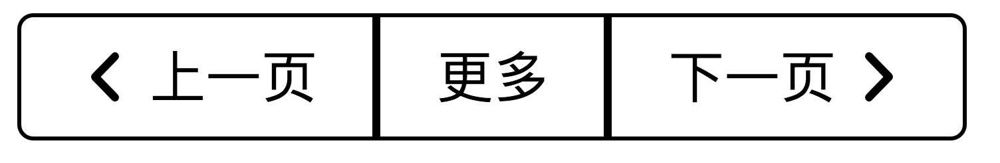

这样会出现边框叠加到一起。通过设置`margin-left:-1px`，让靠左元素的右边框被靠右元素的左边框覆盖

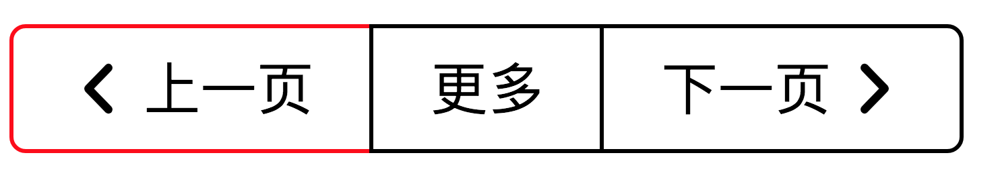

最后再设置元素 hover 时 `z-index:2`，解决 hover 时边框缺口的问题。

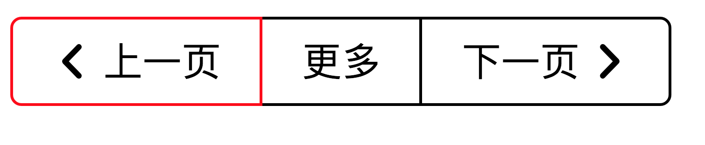

## 在 `mouted` 阶段检查子元素的是否全为 `g-button`
* 先通过 this.$el.children 拿到所有子元素的NodeList
* 再通过 `for…of` 循环来遍历每个子元素
* 检查元素的 nodeName 是否为 button，不是则打印出错误提示

[Javascript中的for-of循环 · Issue #11 · wujunchuan/wujunchuan.github.io · GitHub](https://github.com/wujunchuan/wujunchuan.github.io/issues/11)

## 简单的手写单元测试
要用到 `Vue.extend` 这个 API

* [单元测试 — Vue.js](https://cn.vuejs.org/v2/guide/unit-testing.html)
* [测试框架 Mocha 实例教程 - 阮一峰的网络日志](http://www.ruanyifeng.com/blog/2015/12/a-mocha-tutorial-of-examples.html)
* [译-Sinon入门:利用Mocks，Spies和Stubs完成javascript测试 | kazaff’s blog | 要相信，一切都是最好的安排~](https://blog.kazaff.me/2016/11/11/%E8%AF%91-Sinon%E5%85%A5%E9%97%A8%EF%BC%9A%E5%88%A9%E7%94%A8Mocks%EF%BC%8CSpies%E5%92%8CStubs%E5%AE%8C%E6%88%90javascript%E6%B5%8B%E8%AF%95/)

### 了解 Chai.js 这个断言库，接触到三个概念
* BDD — 行为驱动开发 — Behavior Driven Devplopent。
* TDD — 测试驱动开发 — Test Driven Devplopent
* Assert — 断言

* [初识 TDD | GeekPlux](https://geekplux.com/2014/03/21/understand_tdd)
* [Chai.js](https://www.chaijs.com/)

## 第一次写测试代码
简单的熟悉断言库的语法
```js
expect(xxx).to.equal(yyy)
expect(xxx instanof Array).to.eq(true)
```

* 先搞出一个组件的实例。
* 在构造函数中通过 propsData 选项传入 props

我们需要测试：给 Button 组件的 icon 这个 props 传入 `“settings”`，这个 Button 组件的 DOM元素（$el）中会有一个 settings 的 icon。
翻译成程序语言也就是说：svg 的 <use> 标签的属性 `xlink:href` 的值将会等于 `settings`
也就是下面代码中最后一行，使用断言库 Chai 来书写我们的断言语句

```js
const Constructor = Vue.extend(Button)
const button = new Constructor({
  propsData:{
    icon: "settings"
  }
})
button.$mount("#app")
let userElement = button.$el.querySelector("use")
let href = useElement.getAttribute("xlink:href")
expect(href).to.equal("#i-settings")
//销毁实例，从内存中移除
button.$destroy()
```

我们还需要测试：传入`orientation` 为 `right` 时，icon 应该在文字的右边
翻译成测试语言：svg 元素的计算属性为 2
写成代码即为
```js
  let div = document.createElement("div")
  document.body.appendChild(div)
  const Constructor = Vue.extend(Button)
  const button = new Constructor({
    propsData:{
      icon: "settings",
      orientation: "right"
    }
  })
  // 注意这里需要 mount 到页面中，否则不能获取到计算属性
  button.$mount(div)
  window.test = button.$el
  let svg = button.$el.querySelector('svg')
  let order = window.getComputedStyle(svg).order
  expect(order).to.equal("2")
```

测试 Button 组件的 click 事件，需要用`chai-spies`。可以通过一个间谍函数来监控被测试函数是否被调用、以及调用的参数等信息。通过 `chai-spies` 的文档，我们需要做以下步骤
* 引入`chai-spies`这个库
* 把这个库 Plug In 到 `chai`
```js
chai.use(spies)
```
* 创建一个间谍函数
```js
// 把原函数传进去
const spy = chai.spy(original)
```

## 用 Karma 做自动化测试
之前写的单元测试，我们在测试时都需要重新刷新浏览器。并查看浏览器控制台的信息。来确定测试的结果。我们可以通过工具来帮我们让这个流程自动化

* Karma 是一个测试运行器，它可以呼起浏览器，加载测试脚本，然后运行测试用例
* Mocha（[ˈmoʊkə] 摩卡）是一个单元测试框架/库，它可以用来写测试用例
* Sinon（西农）是一个 spy / stub / mock 库，用以辅助测试

在命令行运行 Karma 后，Karma 库就自动帮我们运行测试，并把测试结果并输出。

1. 先得安装所需的各种工具
```js
npm i -D karma karma-chrome-launcher karma-mocha karma-sinon-chai mocha sinon sinon-chai karma-chai karma-chai-spies
```
2. 创建 Karma 运行的配置文件`karma.conf.js`
3. 创建 `button.test.js`文件
4. 创建测试脚本，方便运行测试程序

## 用 Mocha&Chai 做单元测试
[测试框架 Mocha 实例教程 - 阮一峰的网络日志](http://www.ruanyifeng.com/blog/2015/12/a-mocha-tutorial-of-examples.html)
[如何为 Vue 项目写单元测试 - 范明非的Blog](https://fanmingfei.com/posts/A_Vue_Unit_Text_Tutorial.html)

## 使用 TravisCI 做持续集成
编写代码只是软件开发的一小部分，更多的时间往往花在构建（build）和测试（test）。
> 一、什么是持续集成？
> Travis CI 提供的是持续集成服务（Continuous Integration，简称 CI）。它绑定 Github 上面的项目，只要有新的代码，就会自动抓取。然后，提供一个运行环境，执行测试，完成构建，还能部署到服务器。
> 持续集成指的是只要代码有变更，就自动运行构建和测试，反馈运行结果。确保符合预期以后，再将新代码"集成"到主干。
> 持续集成的好处在于，每次代码的小幅变更，就能看到运行结果，从而不断累积小的变更，而不是在开发周期结束时，一下子合并一大块代码。

[持续集成服务 Travis CI 教程 - 阮一峰的网络日志](http://www.ruanyifeng.com/blog/2017/12/travis_ci_tutorial.html)

## 使用 npm 发布自己的包
* 注册 npm 帐号
* `npm addUser`
* `npm publish`
* `npm link`  让开发更便捷

## 优化只有图标时的显示效果
* 在`created` 生命周期检查插槽`this.$slots.default`
* 如果没有插槽代表无文字，只有图标 。把 `iconOnly`  设置为 `true`
* 动态的给 button 添加 `iconOnly`这个类
* 用 CSS 处理多余的 margin

# 轱辘UI — Input 组件
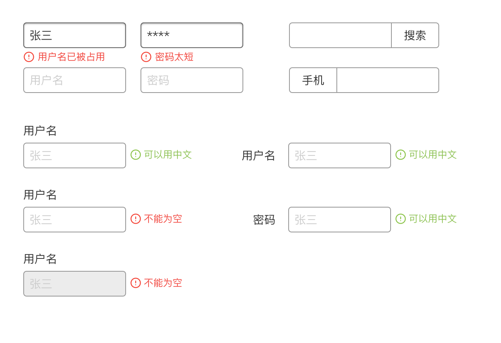
## 给组件添加 `name` 属性
* 方便在 DevTools 中调式

## Vue 单文件组件中的 <style> `scope`
* Vue 会给组件及其所有子元素添加一个属性，这个属性值是该组件唯一的 ID。这样子就不存在 CSS 选择器命名冲突的问题了

## SCSS 变量语法
```scss
// 声明一个 scss 变量
$height: 32px
```

使用 scss 变量写基础样式的值

## 写 input 组件各状态的样式
* 普通态
* focus 态：添加内阴影
* hover 态：让边框的颜色变得更「重」
* disabled 态：输入框背景、文字的颜色变灰色。鼠标的样式呈不可点击
* readonly 态
* error 态：让边框颜色变成红色
* error 态的信息提示：在输入框的右侧添加提示文字及图标

## 稍微熟悉一下 `box-shadow` 属性的值的术语
* offsetX/Y
* blur-radius
* spread-radius

## error 文字的 `v-if` 使用 Vue 的 `<template>`标签
因为在 error 信息中我们需要两个标签一个 `<span>` 用来显示文字，一个`<Icon>` 用来显示图标。我们不必给它们添加一个多余的 div ，而可以使用 vue 提供的 `template` 标签，因为它不会渲染到页面中

## 监听原生 input 组件的事件，并通过 $emit 传出到自定义组件外部
Vue 在调用事件回调函数时，会传入原生事件对象。我们可以用 `$event` 来接收它。`$emit()` 这个函数的一个参数是 String 类型用来定义「事件名称」

我们先让自定义 input 组件有下面几种事件
* change 事件
* input 事件
* blur 事件
* foucs 事件

## 写测试用例
写好事件监听的代码后，我们第一反应会想到要用页面中的组件，进行测试看看监听的事件是否正常。与其这样做，我们不如直接写测试用例。
我们需要测试下面这些情况：
* Input 存在
* 可以接收 value：传入一个 value 值，期望 input 框的 value 值等于传入的值
* 传入 disabled 可以将 input 框设置为 disabled 态
* 传入 readOnly 可以将 input 框设置为 readonly 态
* 可以接收 error，传入的值为提示文字：期望 icon 图标为 error，并且文字为传入的值
* 传入监听事件函数的回调函数可以被触发：
	* 通过原生 JS 的 API，模拟原生 input 框触发 change 事件
	* `let event = new Event("change")`
	* `inputElement.dispatchEvent(event)`
	* 然后期望间谍函数被触发，并且调用时的参数为 event

## 优化测试代码
利用 Mocha 框架的 API
 * before
 * beforeEach
 * afterEach

优化相似的代码通过 forEach 来循环做

## Vue 的双向绑定
## 理解 v-model 的语法糖
## 让自定义 input 组件实现 v-model

#项目笔记# 轱辘 UI — Popover 组件
## UI 设计


## 参考 Element UI 的 API 设计
```html
<g-popover>
  // 作为默认插槽放入组件中
	<g-button></g-button>
  <template slot="content">
    <div>Some Text..<div>
  </tempdate>
</g-popover>
```

## 每个组件实例维护自己的 `visible`的状态，用`v-if`来控制 Popover 的显示与隐藏
## Vue 的 `<slot>` 无法设置 Class、添加事件
我们最开始写的组件的 HTML 模板是这样子
```html
<template>
  <div class="popover-wrap">
    <slot name="content"></slot>
    <slot></slot>
  </div>
</template>
```
* 本来是应该监听插槽中的那个「触发」按钮的 `click` 事件，但由于 不能在`<slot>` 上添加事件监听。我们将 `click` 事件监听放在整个组件的 `div` 上。
* 而且不能添加 class，所以不得不再给 content 这个具名插槽外面添加一个 div 来包裹这个 `content`的插槽。把 class 都加在这个包裹元素上

## 添加事件，用户在点击页面中其他位置时会隐藏「内容弹出层」
添加原生的事件监听器，我们可能会很习惯性的`document.body.addEventListener()` 。但是，我们是在「造轮子」，用户的 `body` 元素可能并不会是挣满整个屏幕。所以我们应该监听的是 `document` 元素的事件。要考虑并注意这些细节
然后我们又会很自然的想到下面的代码
```js
clickHandler(){
  // 让 visible 状态取反
  this.visible = !this.visible
  if (this.visible === true){
	   // 同步代码，立即执行
    document.addEventListener('click', ()=>{
      this.visible = false
    })
  }
}
```

但是，会发先*无法让 Popover 显示*的BUG。是因为在点击「触发」按钮后，调用`clickHandler` 这个函数时。函数内的代码都是「同步代码」，所以会马上添加一个事件监听器。此时 click 事件还未执行完，所以`this.visible = false` 又会立即执行。

> Vue 异步执行 DOM 更新。只要观察到数据变化，Vue 将开启一个队列，并缓冲在同一事件循环中发生的所有数据改变。

我们需要用 Vue 的`this.$nextTick` 这个 API ，让添加监听器`addEventListener`是*异步的代码*。
也就是说第一行的`this.visible = !this.visible` 代码执行完后，不立即执行下面的代码。把下面添加监听器的代码，放在 DOM 更新完成后才会被调用。
```js
clickHandler(){
  //...
  if (this.visible === true){
    this.$nextTick(()=>{
      // 在 DOM 更新完成后才会调用
      document.addEventListener('click', ()=>{
        this.visible = false
      })
    })
  }
}
```

* [异步更新队列 — Vue.js](https://cn.vuejs.org/v2/guide/reactivity.html#%E5%BC%82%E6%AD%A5%E6%9B%B4%E6%96%B0%E9%98%9F%E5%88%97)
* [vm.$nextTick — Vue.js](https://cn.vuejs.org/v2/api/#vm-nextTick)

## JS 原生事件监听器的的移除
分析上面的代码，我们每点击一次都会添加一个新的监听器。这个监听器执行时的回调函数指向了一个新创建的匿名函数。
所以我们会想到`removeEventListener`，就会需要将回调函数从匿名函数的箭头函数改成*有名字的函数*（代码中给它取了个名字叫`visbleToFalse `）
把箭头函数改成普通的函数，这个又会造成回调函数内`this` 的变化。我们又会想到用 `bind` 方法来解决`this` 的问题，所以代码看起来是这样的
```js
clickHandler(){
  //...
  if (this.visible === true){
    this.$nextTick(()=>{
      // 在 DOM 更新完成后才会调用
      document.addEventListener('click', function visbleToFalse()=>{
        this.visible = false
        document.removeEventListener('click', visbleToFalse)
      }.bind(this))
    })
  }
}
```

## `bind` 方法给我们带来一个BUG
`addEventListener` 时指定的回调函数是`visbleToFalse.bind` 创建的一个新的函数。而`removeEventListener`时移除的却是`visbleToFalse` 这个函数。

这里遇到一个小坑，使用`removeEventListener('click',foo)`。这个 foo 应该和`addEventListener('click', foo)` 中的 foo 函数的内存地址相同。
当我们无法确定：「原生的 click 事件监听器是否被正常的添加和移除」时，可以通过 Chrome 浏览器的开发者工具中的 Elements — Event Listeners 来帮助我们调试代码。

* [记录在 Vue 的方法中使用原生 addEventListener 和removeEventListener 时遇到的小问题 · GitHub Gist](https://gist.github.com/code661/adea9daeb137556eb815a490fedc1d60)

## 放弃使用普通函数和 bind，改用用名字的箭头函数
## 浏览器的事件冒泡机制，让我们在点击 Popover 元素时 document 事件的回调函数也被执行
通过`.stop` 修饰符，来阻止单击事件继续传播。

```html
<div class="popover-wrap" @click.stop="clickHandler"></div>
```

## 使用`.stop`也遇到问题
在我们使用`.stop`阻止了 Popover 组件最外层元素的事件传播后，会导致组件外层的元素无法触发该事件。也就是说我们阻断了事件的传播，所以我们在「造轮子」时是不能这么做的。所以不得不思考另一种实现方式

## 将元素从 Popover 组件内移到 body 元素的最后面
通过 `appendChild` 来实现。
用 `v-if` 指令隐藏的元素不存在于 DOM 树中，所以在通过`this.$ref` 去取值的时候会是`undefined`
* [关于Vue中的$refs对象和Dom对象复用问题](https://zhuanlan.zhihu.com/p/37129813)

### 获取到组件「触发按钮」元素的位置，并设置「弹出内容」元素的绝对定位的值
### `getBoundingClientRect` 和绝对定位之间偏移值的修正
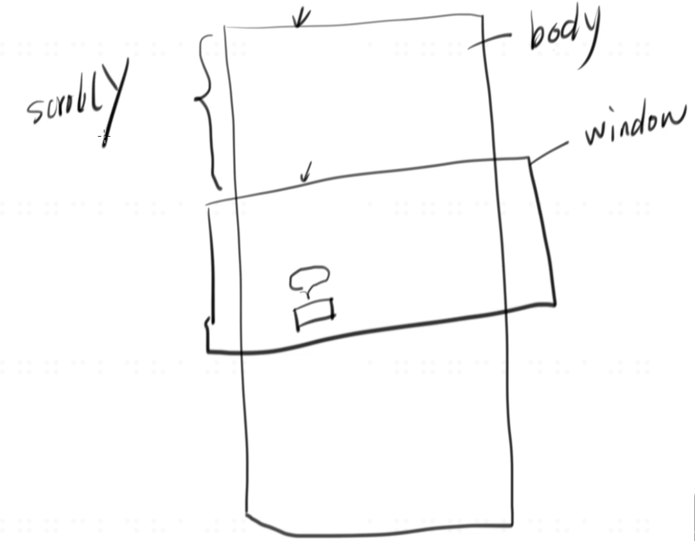

## 整理逻辑，让代码「高内聚、低耦合」一些
⭐️ 整理思路：在 `click`事件的处理函数中，以及 document 的回调函数中都可以拿到的原生事件对象。我们可以去通过`event.target`来判断，用户是点击的 `document`元素还是「触发按钮」或者是「弹出内容层」。然后在每种点击位置、再结合`visible`的状态分别处理，看是什么都不管（直接 return）调用去调用`close`、`open`方法

* `onClick` 函数是点击 Popover 组件的后入口函数，整个逻辑也从这个开始。
	* 在被点击时根据`visible`的状态，来决定调用`close` 还是 `open` 函数
* `open` 函数将`visible` 状态切换成`true`，并在 DOM 更新后（`nextTick`钩子）中添加 document 的监听器
* `close` 函数将`visible` 状态切换成`false`，并移除 docuemnt 的监听器
* `onClickDocument` 是 docuemnt 监听器的回调函数
	* 在里面需要判断，用户点击的是 Popover 组件本身（包括「内容层」和「触发按钮」）还是页面中的其他元素
	* 如果点击的不是 Popover 组件本身，就需要调用`close`方法
	* 🤯 这里需要想明白的一点是：当点击到「触发按钮」时为什么也要 return 处理？因为此时`visible`的状态一定是`true`，直接交给`onclick` 的逻辑处理即可
* `setPopoverPosition` 设置「内容弹出层」的绝对定位的位置。方法是先获取到「触发按钮」的位置再用 JS 设置`left` 和`top` 的值

## 优化代码时的思考：为什么要写测试代码？
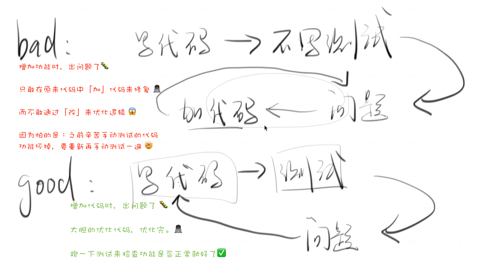

## 写基础样式
`margin-top`可以改变绝对定位元素的位置

## 利用伪元素做小三角形

## 实现四个方向
`setPopoverPosition` 函数在给「内容弹出层」的绝对定位的位置时，需要根据不同的`position`来设置不同的值
并且给生成相应应的 class。再用 class 去设置 CSS

## 表驱动编程
解决多个 `if...else` 带来的代码冗余、可读性差的问题。在`setPopoverPosition `函数这样的场景时，做代码优化

## 使用`slot-scope` 将组件内部的 click 方法暴露给外部插入插槽的元素
## 增加 `hover` 的激活方式
需要优化鼠标从「触发按钮」移动到「弹出内容」时，让「弹出内容层」不会被隐藏。
```js
handleMouseenter() {
  if (this.enterTimer) clearTimeout(this.enterTimer);
  this.enterTimer = setTimeout(() => {
    this.openContent();
  }, 100);
},
handleMouseleave() {
  if (this.enterTimer) {
    clearTimeout(this.enterTimer);
    this.enterTimer = setTimeout(() => {
      this.closeContent();
    }, 100);
  }
}
```


# 轱辘UI — 网格系统
> ⭐️ 程序员（软件工程师）的工作 50% 以上不是写代码

## 什么是网格系统/栅格系统
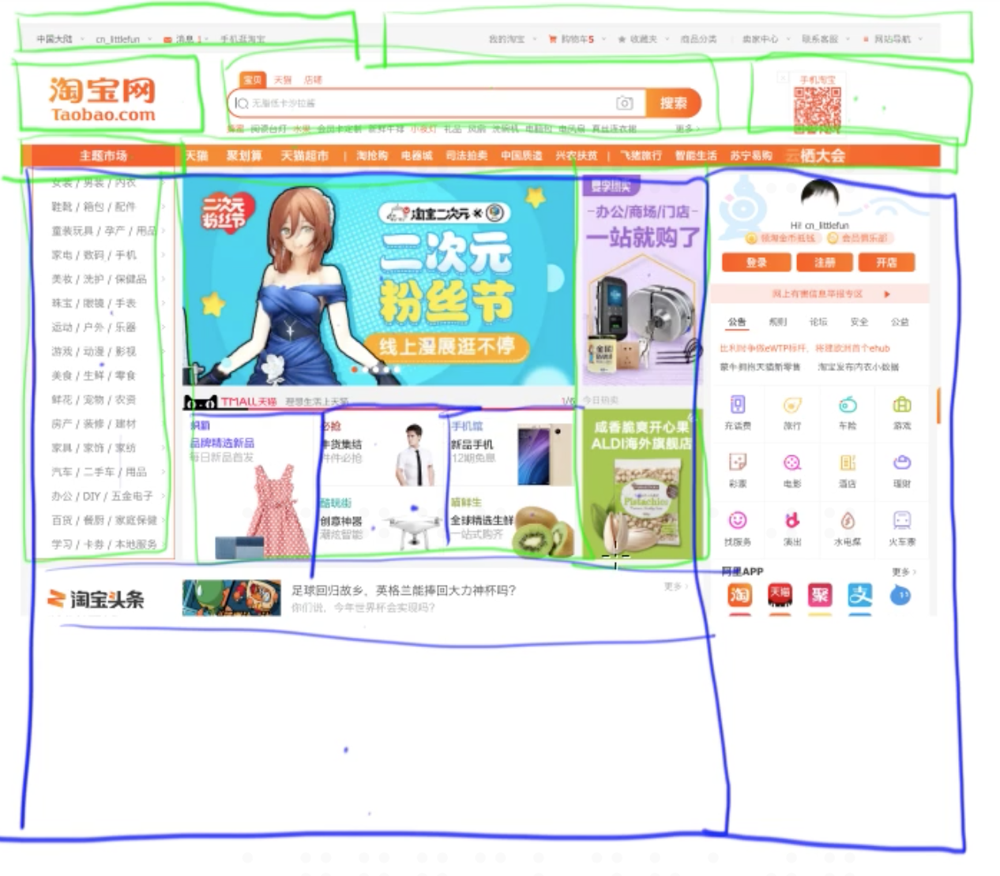

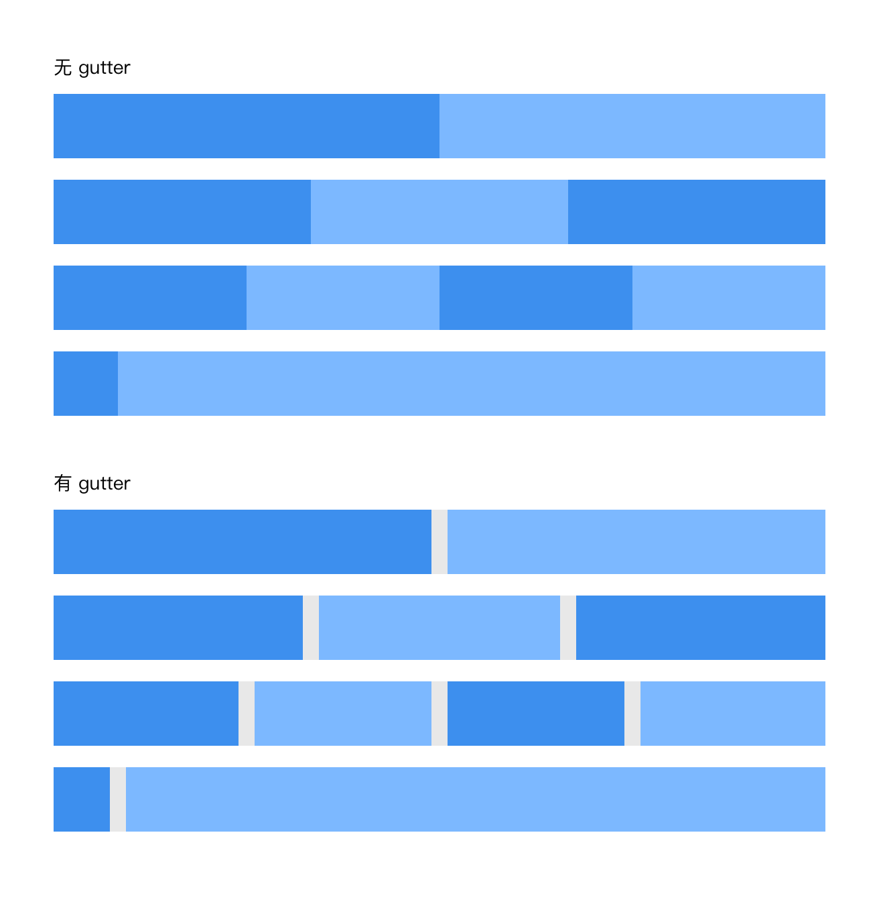

## 从使用者的角度考虑如何设计 API
```html
<g-row gutter="8">
  <g-col span="12">
  </g-col span="12">
</g-row>
```

* `g-row` 组件定义行
* `g-col`组件是 g-row 的子组件
* span 是 `g-col` 的跨度，gutter 是 row 之间的间隙

## 分析实现思路
一个 `row` div 就是一行（块级元素占一行的空间）把它的`dispaly` 设置为 flex（弹性盒）
一个`col` div 是 `row`  的子元素，默认是靠左排列。如果不设置`col`的宽度，那么将会在 `row` 里面均分宽度。

我们通过给 `col` 添加不同的 class，来操作它的样式（设置宽度），将一个整行（也就是 row 的宽度）分成 24 份。如果使用者需要让 col 占据这 「24 份」中的 「2 份」的宽度，那么这个 col 的宽度就需要是 `(2 / 24) * 100%`。其余的情况也就依次类推了

## 用SCSS 的循环语法（`@for`）
* 由于要在 CSS 中定义每个列的宽度百分比，我们就需要给每个不同的跨度的列创建一个 CSS 选择器。这样会很无聊和麻烦，我们可以通过 SCSS 的循环语法来帮助我们。

```scss
// scss 中声明一个变量
$class-prefix: col-;
@for $n from 1 through 24 {
	// #{xxx} 是 scss 插值语法 类似于 ES6 的 `${}`
  &.#{$class-prefix}#{$n}{
    width: ($n / 24) * 100%
  }
}
```

* [Sass control directives: @if, @for, @each and @while](http://thesassway.com/intermediate/if-for-each-while)
* [sass揭秘之@if，@for，@each_Preprocessor, Sass, SCSS, sass揭秘 教程_w3cplus](https://www.w3cplus.com/preprocessor/sass-advanced-application.html)
* [SASS用法指南 - 阮一峰的网络日志](http://www.ruanyifeng.com/blog/2012/06/sass.html)

## `Col`组件根据传入的 `span` 动态绑定 class
```js
<div class="col" :class="[`col${span}`]"></div>
```

## 实现 Col 组件偏移的需求

给需要 offset 的元素添加对应百分比的 margin ，如 offset 为 2，那么需要添加的`margin-left` 为 `(2 / 24 )* 100%`

根据传入的 `offset`值动态绑定 offset 类，如传入`span`为2，那么得到 class 为 `span-2`。并且在不传的时候没有这个 class。利用了 JS 的与逻辑运算符 `&&`

```js
offset && `offset${offset}`
```

> `expr1 && expr2`如果 `expr1` 能转换成`false`则返回`expr1`，否则返回`expr2`。因此，与布尔值一起使用时，如果两个操作数都为`true`时`&&`返回`true`，否则返回`false`。

## 实现 gutter 的需求
在 row 组件中使用者会传入 gutter ，是想做到每个 `Col` 组件之间会有固定的间隙。我们使用 Vue 的动态绑定 style 的特性。将这个间隙，加在 Col 组件元素的 *padding* 上（因为 margin 被用来控制`offset`）
*我们先需要将这个 gutter 值从 Row 组件传入到它插槽中所有 Col 组件下*，然后 Col 组件再拿到 gutter 值来设置它自己的 padding，我们就需要用到 `mounted` 生命周期的钩子函数来做「传 gutter 的值」这件事情。
另外，我们给每个 Col 组件添加了`padding` 来实现 gutter。需要给 Row 添加 负 margin 来*抵消掉两头多出来的空间*。

## 熟悉 Vue 的生命周期的 API，将`gutter`传入数据给插槽中的子组件`Col`
打一个类比，来描述 Vue 的 `mouted` 和 `created` 生命周期的不同点
```js
var div = document.createElement('div') // created
document.body.appendChild(div) // mounted
```
* 第一行代码，是在*内存*中创建一个 div 的 DOM元素。
* 第二行代码才是*渲染到页面*中。
我们可以类比的理解 Vue 的这两个生命周期的不同点，理解了上面类比的代码，再去想想 Vue 的 `created`和`mounted` 生命周期。

当存在父子关系的两个 Vue 组件时，那么父子组件 mouted、created 顺序是怎样的呢？ 
我们可以通过在生命周期的钩子里添加 `console.log()` 来分析出。结果是：先父组件 created，再子组件 created。然后子组件 mounted 到父组件中，最后父组件 mouted 到页面上

## 写代码中的「重构」与「重写」
重构：在每写完基础的功能后，我们进行一些*小的调整*来让代码变得更「好」。也就是说完成一个小功能就要进行「重构」，「重构」应该是我们每天都要做的事情。那么什么遇到什么样的代码需要重构呢？
* 重复 2 次及以上的代码
* 一眼看，看不懂的代码
* 如果严格一点，超过 5 行的代码都是可以进行重构的

再来看看「重写」，比如我们在遇到很赶的项目的时候，很多时候更注重的是功能上的实现。但是代码的逻辑比较混乱，在后面需求变更时就很难进行维护，这时候就会要进行「重写」。也就是进行大调整，根据之前的逻辑，代码删掉全部重新来写。所以要避免这种情况的出现。

🐛 最后，我们还要有一个认识：有重复的代码就有机率出现 BUG，重复的代码越多，出现 BUG 的可能性就越高。

## 添加 align 功能
给 Row 组件传入`align`的值为 `left`、`right`、`center`，里面的元素将会分别靠左、靠右、居中排列。这是使用 flex 的 `justify-content: flex-start | flex-end | center` 来实现

## 实现响应式布局
## 验证器检查 props 值是否合法
遍历检查传入对象的所有 `key` 的值，是否在规定的数组内

## 用媒体查询实现响应式
1. 使用者会给组件传入的 `phone`是 `{span:2, offset:0}`
2. 我们需要将传入的值表现在 HTML 的 Class 属性中（动态的添加 Class）
3. 然后通过不同的 Class 来做 CSS 样式的操作。给每个宽度区间的设备写不同的 CSS(规则还是 24 等分总宽度)
4.  再用媒体查询应用不同的 CSS。

定义媒体查询，用后面的CSS优先级特性（选择器优先级相同时，代码靠后的 CSS 语句优先级更高）

* [CSS深入浅出 - 媒体查询 — 写代码啦！](https://xiedaimala.com/tasks/f61cdba2-cea3-4da1-90b6-3f37bd8d6d5b/video_tutorials/2e0b3e83-5009-44ff-abbd-565621060abe)

## 用 JS 的展开语法处理 class 数组
```js
computed:{
  colClasses(){
    return [
      ...( pad ? [`pad-col-${pad.span}`]: [] )
    ]
  }
}
```
[展开语法 - JavaScript | MDN](https://developer.mozilla.org/zh-CN/docs/Web/JavaScript/Reference/Operators/Spread_syntax#%E6%9E%84%E9%80%A0%E5%AD%97%E9%9D%A2%E9%87%8F%E6%95%B0%E7%BB%84%E6%97%B6%E4%BD%BF%E7%94%A8%E5%B1%95%E5%BC%80%E8%AF%AD%E6%B3%95)
## 分析思路，解决 BUG
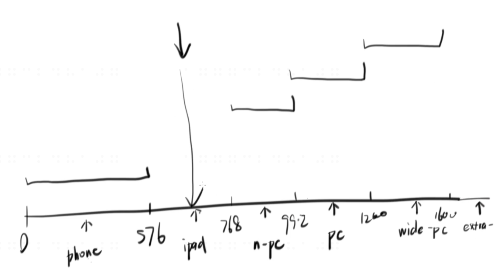

结合上图来思考，当没有传入对应设备的 prop（无该设备的 class），但媒体查询匹配到该区间。会导致样式缺失的 BUG，我们需要重新思考媒体查询的匹配机制。
如下图的方式进行不同宽断区间的划分。一个设备可以应用多个媒体查询的 CSS 样式，由于后面（写在后面）的媒体查询优先级更高就会覆盖前面媒体查询的样式。 

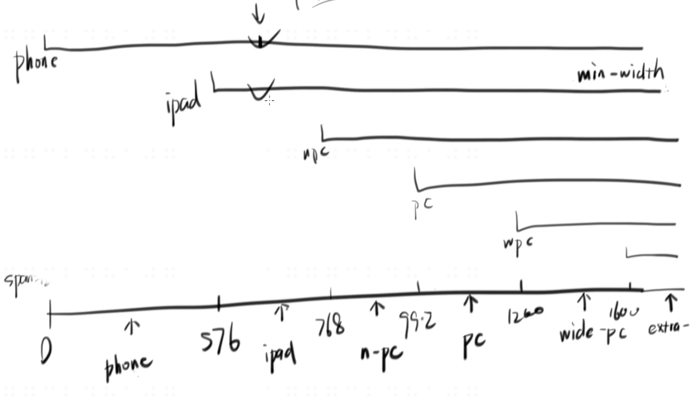

## 重构优化代码
* 学习使用 ES6 的函数默认参数
* 将做相同事情的代码，封装成一个函数。并给这个函数起个名字（它做了什么事情），增加我们代码的易读性
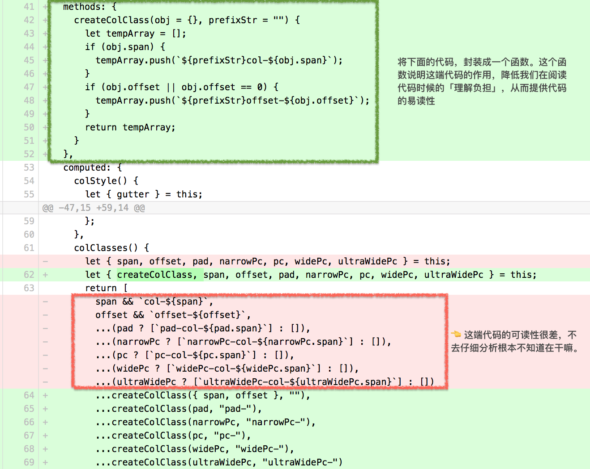


## 写测试用例
关于 CSS 的单元测试很不方便。比如，我们给 Row 组件添加单元测试时，测试它「可以传入 gutter」传入 gutter 的 Row 组件，它的子组件之前会有相应的间隙。我们最开始就遇到一个问题，要在 JS 代码中（单元测试代码）让 Col 组件成为 Row 的子组件，我们想了下面这个方法。通过写入 HTML 再去新建一个 Vue 实例，去解析 HTML 模板。

```js
// 测试代码
describe("Col 组件", () => {
  it("可以传入 gutter", () => {
    Vue.component("g-row",Row)
    Vue.component("g-col",Col)
    let div = document.createElement("div");
    console.log(div)
    div.innerHTML = `
      <g-row :gutter="10">
        <g-col></g-col>
      </g-row>
    `
    document.body.appendChild(div);
    const vm = new Vue({
      el: div
    })
    // console.log(vm.$el.outerHTML)
  });
})
```

## 在测试时遇到BUG，再理解 Vue 的生命周期及钩子函数
在上面的测试代码中，我们观察 `console.log(vm.$el.outerHTML)` 的结果，会发现 `padding`  并不是我们所想的`10px`，而是 `0px`。
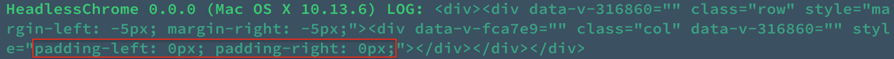

我们再来分析出现这个 BUG 的原因，这是一个*「console 的时机问题」*
1. Vue 的 `mouted` 的钩子函数的调用是异步的方式（猜测）
2. 我们是在 `mouted` 的钩子函数中才把 Row 组件的 `gutter` 赋值到 Col 组件中
3. 我们的 `console.log` 是同步代码，先于 `mouted` 钩子函数执行，所以此时的 `console.log` 结果不是预期的数值

如果我们通过`setTimeout` 将 `conosole.log` 函数放入异步队列中。将会得到预期的结果
```js
// 测试代码
describe("Col 组件", (done) => {
    // ...
    const vm = new Vue({
      el: div
    })
    // 加入异步队列
    setTimeout(()=>{
      console.log(vm.$el.outerHTML)
      done()
    },0)
  });
})
```

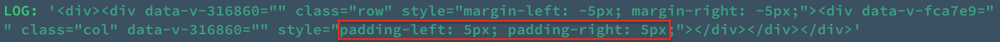

## 测试框架 Mocha 的 `done` 的运用
用来配合测试用例中的异步代码，如果不传入 `done` 参数到测试函数中，测试框架将默认的认为，测试函数中的代码都是同步的。如果传入`done`，我们可以在适当的时机调用 `done` 来告诉测试框架，我们的异步代码执行完毕
```js
// 传入一个参数 done 
describe("Col 组件", (done) => {
    setTimeout(()=>{
      console.log(vm.$el.outerHTML)
      done()
    },0)
  });
})
```

* [Mocha - 异步测试代码](https://mochajs.org/#asynchronous-code) 

## 布局组件 — Layout
* Layout
* Header
* Content
* Footer
* Sider

## 用 Flex 实现布局
## Sider 和 Layout 是兄弟元素的关系时，布局为左右
在 Layout 的 mouted 生命周期阶段检测子组件的 name 是否拥有 Sider。
动态的绑定一个类，并用 CSS 控制 `flex-direction` 的值

## 用 Vue 的 `<transition>`组件，给 Sider 的显隐增加过渡动画

# 造轮子总结
* 没有明确需求就不要写代码、没有设计稿也不要写代码。明确这一点可以让你少加班
* 单元测试是重构的前提

* 工具方面的知识能用就好，有需求时就根据官方文档拿来用。边用边学
* 核心概念要搞得非常清楚，比如说 Vue 的响应式
* 设计模式和写代码的套路
	* 表驱动编程
	* 发布订阅模式
	* 单向数据流
	* 组件的 API 设计要符合正交原则
* 代码的要风格统一，让别人更易于理解
* 面向离职写代码
	* 将所有的东西文档化
	* 因为你准备要离职，会希望自己在离职代码不要那么难看。会有一种被观察感，在潜意识中会对自己写出来的代码有严格的要求
	* 要在团队中表现优异

# 轱辘UI — Collapse 组件
# UI 设计
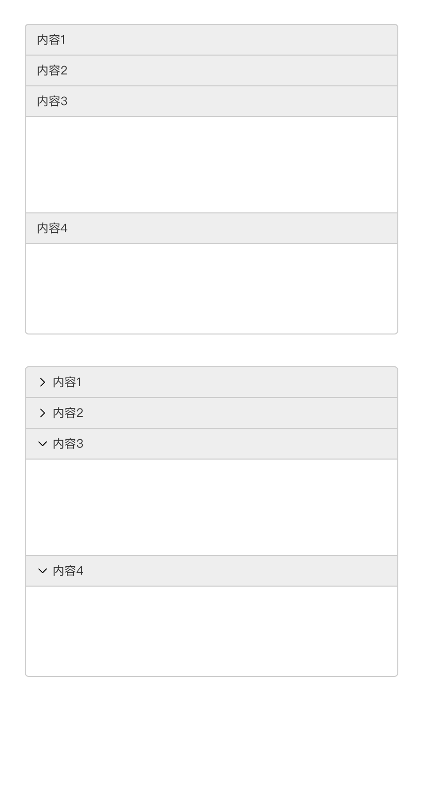

## 写样式
用 CSS 否定伪类`:not()`、`first-child`、`last-child` 处理边框重复的情况。

## 最简单的功能实现
组件内`open` 变量是`Boolean`类型，标识组件打开的状态，当点击标题时将`open`的值取反，再配合`v-show` 组件即可实现。
## 要实现手风琴模式，引入事件中心
当我们添加「手风琴模式」的需求时，在一个面板被打开时需要将其他的面板关闭。子组件`collapse-item`的实例需要在打开时通知其他实例，其他的实例在收到通知后将自己关闭。所以我们引入`eventBus`来做全局的事件中心。

我们的想法是使用者在给 Collapse 组件传入`accordion` 这个参数时就让 `provide` 生效，子组件才能拿到`inject`中的事件中心来通知其他子组件。但由于`provide`和`inject` 选项不能是动态的。所以，这个方案会在控制台会出现警告，因为父组件不`provide`的情况下子组件却使用`inject`。
## 可定义指定默认打开某个面板
给 Collapse 组件传入 selected，选项的值是默认打开项的 `name`
## Collapse 组件外部可拿到当前打开项
在 Collapse 中监听事件中心的`update:OpenItem` 这个事件，当事件被触发时。可以拿到被点击面板的`name` 值，再调用`this.$emit` 把这个 `name` 的值传到外部。这样外部就可以使用`.sync` 修饰符，拿到当前打开项的`name`的值

## 换个方案重新实现手风琴模式
因为之前实现手风琴的模式是利用`provide`来做的。在 Accordion 模式下，子组件是拿不到`eventBus`。但我们上面的「默认打开某个面板」功能的实现却依赖于`eventBus` 。所以我们另外想一个方案来实现。

## 在打开多个面板时，外部拿到的是一个数组
## Collapse-item 被打开，增加该组件实例的`name`到数组。被关闭时从数组中移除
## ⭐️ 状态混乱！引入单向数据流的思想
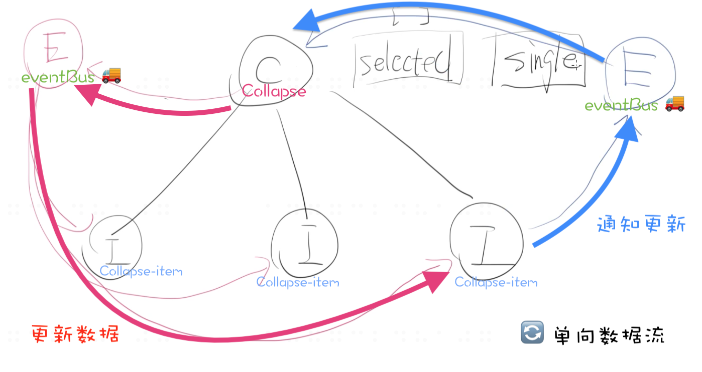
